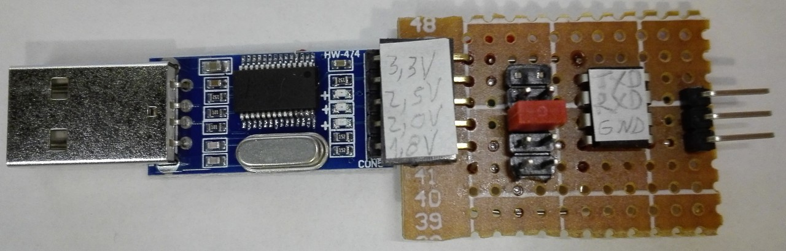
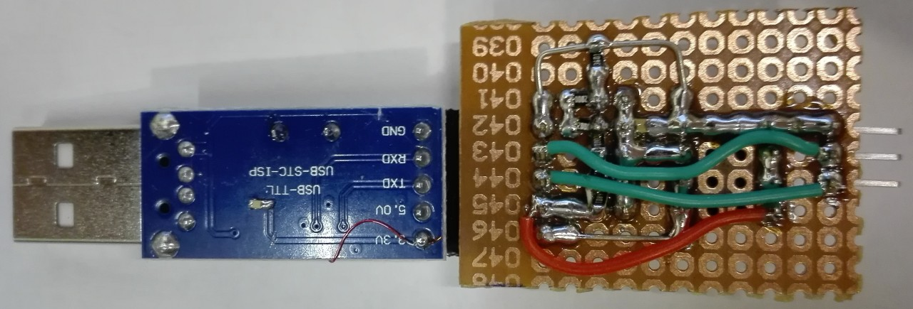
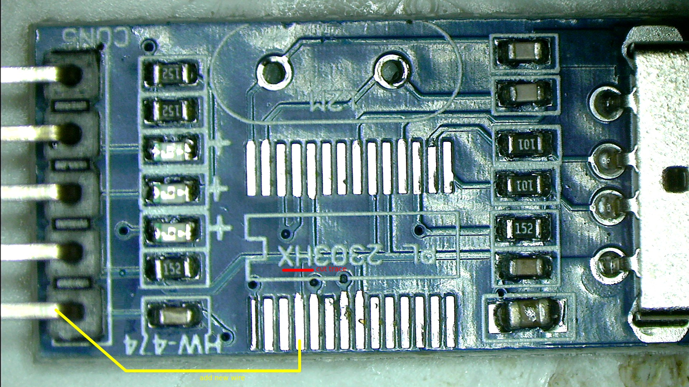
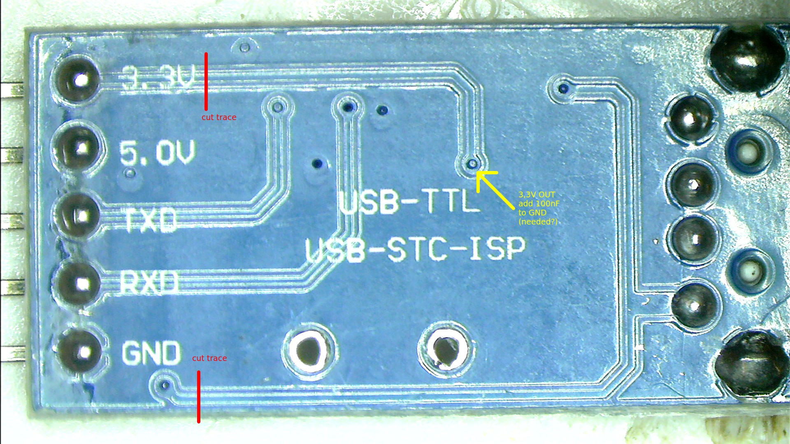

# PL2303-voltage-mod
How to modify a cheap USB to serial converter based on PL2303 to be able to select the IO-voltage (1,8-3,3V)

## What is this?
This repo contains informations on how to modify a cheap, generic USB to serial converter (based on the PL2303) and design an addon to be able to select the IO-voltage (of RXD and TXD).

## Licence
CC BY-SA 4.0 and NO WARRANTY!

## Why?
I needed to talk to a device that uses 2,5V and USB to serial converters for this voltage are not widely available and not cheap. I was using a 5V version with an external level-shifter but this is not really convenient, so i made this contraption...

## Theory of operation
The PL2303 has a dedicated pin (pin4) for the IO-voltage that can go anywhere from 1,8V to 3,3V. It seems that with some versions (the old PL2303 but not the PL2303HX??) this pin can even be connected to 5V, at least it was on my board. I don't know what IC i have exactly as it is unmarked, but the presence of a crystal indicates it is probably the non-HX version (so the seller scammed me...). *If anybody is familiar with the different versions of the PL2303 please share some informations.*  
I modified my converter and designed and made a small addon PCB so i can select (using a jumper) between 3,3V/2,5V/2,0V/1,8V (or any voltage between using an external supply). *Please note that there is no 5V option because of the parts i used (see below)*. However 5V (and also 3,3V) USB to serial converters are easely available, so this is not really important.

## The original board
I reversed it, see `schematic_PL2303_module.pdf`.

## The modification of the module
Basically you need to cut some traces and solder a small wire between pin 4 of the PL2303 and the (now unused) 3,3V-pin of the connector. You should also add a capacitor (100nF) on the 3,3V *output* of the PL2303, but i am not sure this is actually needed. For this you need to remove some soldermask. Please note that one trace to cut is *below* the PL2303 so you need to remove and resolder it (hot air station needed). There is no need to desolder the crystal, i only did it for reverse engineering the board.

Because the LED for TX/RX-activity are connected between 5V and TXD/RXD we have to disable them (cut the 5V trace), so they will no longer work. You could connect them to V_IO but depending on the selected voltage this might not work well. I do not need these LED so i did not try.

## The addon-PCB
The schematic is in `schematic_addon.pdf` and the Kicad5 project in `/schematic`. I don't have a proper PCB-layout, i bodged everything together on a piece of perfboard.  
This PCB uses the 5V from USB and some resistors to make a "multi-stage" voltage divider for the different voltages and a LM358 as a buffer. Because the LM358 is not rail to rail it cannot output 5V with Vcc=5V. If you really need a 5V option you can always use another (rail to rail on input *and* output) operational amplifier. It might even be possible to skip the operational amplifier completly but you probably would need a much lower resistance for the voltage divider to give more "stiff" voltages under load. This would increase the power consumption of the board and the heat dissipation in the resistors. Something like a LM358 is cheap and easy to solder in DIP, so i did not try without.  
As you can see the entire thing is pretty basic. I used a piece of perfboard and a mix of THT and SMD (for the resistors and the capacitor). With some fiddeling 0805 barely (better use 0603?) fits between 2 pins of a 2,54mm pitch connector. You will notice that i did initially add a 5V option but as i said i won't work (3,6V only on the output of the LM358) so i cut the corresponding pins.

## Possible improvements
Design and have a real PCB manufactured with only SMD parts and another opamp to have a even smaller PCB and be able to select between 5V and 1,8V (maybe even add a potentiometer for "custom" voltage?). However considering that you need to modify the USB to serial converter too it might even be better/easier to design a complete USB to serial converter and the "addon" on the same PCB. If you do so please share.
